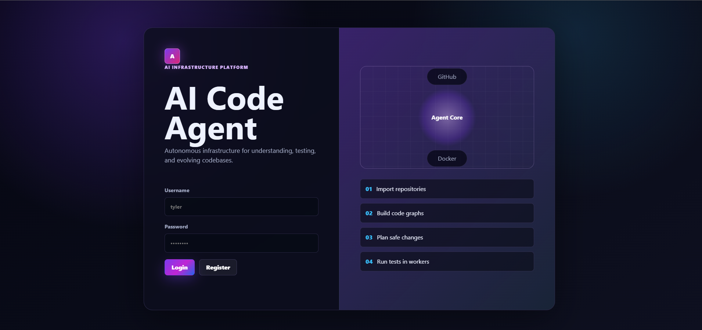
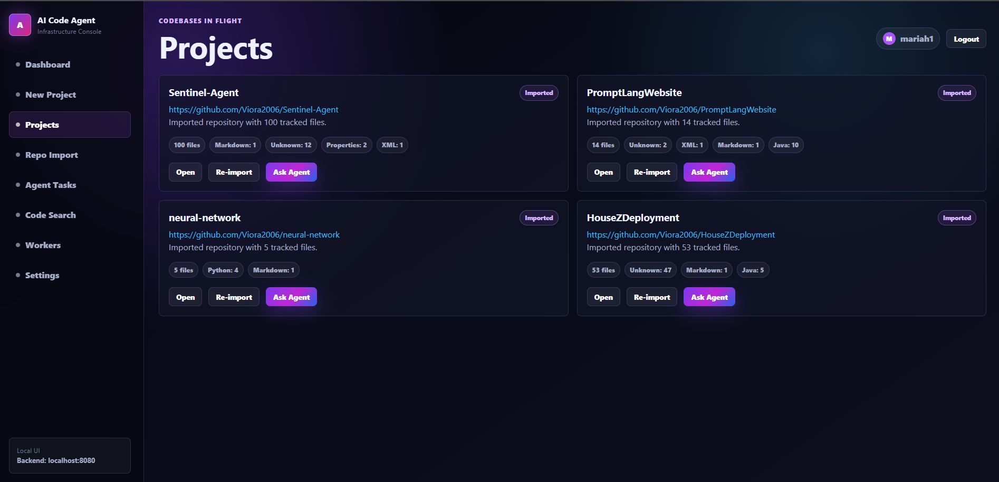
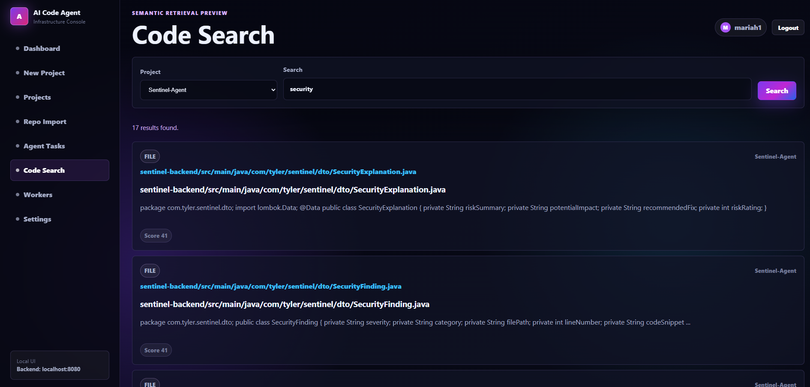

# AI Code Agent

AI Code Agent is a long-term AI infrastructure platform designed to help developers understand, index, search, test, and eventually modify codebases using agentic AI workflows.

This project is **not** meant to be a simple ChatGPT wrapper. The long-term goal is to build a scalable developer platform that combines traditional backend engineering, code intelligence, repository analysis, semantic search, distributed workers, Docker-based execution, and AI planning agents.

---

# Vision

Modern AI coding tools are evolving beyond autocomplete.

The goal of AI Code Agent is to become a platform capable of:

- Understanding entire repositories
- Parsing source code into structured representations
- Building relationships between classes, methods, interfaces, and files
- Searching code semantically
- Planning software tasks using LLMs
- Running code inside isolated Docker environments
- Executing automated tests
- Recovering from build failures
- Creating commits and GitHub Pull Requests
- Monitoring distributed worker systems

The primary objective of this repository is **learning**.

Instead of building ten small projects, this project is intended to teach nearly every modern backend engineering concept through one large, scalable system.

---

# Long-Term Tech Stack

## Backend

- Java
- Spring Boot
- Spring Security
- PostgreSQL
- OpenAI SDK
- JWT Authentication

## Frontend

- React
- Vite
- JavaScript
- CSS

## Future Infrastructure

- Redis
- RabbitMQ (or Kafka)
- Docker
- Docker Compose
- Kubernetes
- JavaParser
- Tree-sitter
- pgvector
- Qdrant
- GitHub API
- Prometheus
- Grafana

---

# High-Level Architecture

                     React Dashboard
                            │
                    Spring Boot API
                            │
                     PostgreSQL
                            │
                  Project Management
                            │
                 Repository Importer
                            │
                   Repository Scanner
                            │
                    Code Parser Layer
                            │
                  Semantic Search Layer
                            │
                    AI Planning Agent
                            │
                     Worker Queue
                            │
       ┌────────────────────┼────────────────────┐
       │                    │                    │
   Worker 1             Worker 2            Worker 3
       │                    │                    │
                 Docker Containers
                            │
                 Test Execution Engine
                            │
                GitHub Pull Requests

---

# Development Philosophy

This project should be built in layers.

Never attempt to implement every planned feature immediately.

Every layer should be fully functional before moving to the next.

The architecture should always remain scalable.

Avoid quick hacks that will make future expansion difficult.

---

# Phase Roadmap

## Phase 1

Frontend

- Authentication page
- Dashboard
- Sidebar
- Project creation
- Local project state

## Phase 2

Authentication Backend

- Spring Boot
- PostgreSQL
- JWT
- BCrypt

## Phase 3

Repository Import

- Accept GitHub URL
- Clone repository
- Store metadata
- Scan file tree

## Phase 4

Repository Database

Store:

- Projects
- Files
- Languages
- Paths
- Raw source code

## Phase 5

Code Parsing

Parse repositories into:

- Classes
- Methods
- Interfaces
- Imports
- Packages
- Fields
- Constructors
- Annotations

Eventually support multiple languages through Tree-sitter.

---

# Repository Understanding

Repositories should NEVER simply be treated as text.

Instead they should become structured graphs.

Example:

UserController
    ↓
UserService
    ↓
JwtService
    ↓
UserRepository

The platform should understand these relationships.

---

# Semantic Search

The platform should support semantic retrieval instead of only keyword matching.

Example:

User asks:

"Where is authentication handled?"

The platform should retrieve:

- SecurityConfig.java
- JwtService.java
- UserService.login()
- AuthController.java

even if the exact keyword "authentication" is missing.

Future implementations should use embeddings with:

- pgvector
- Qdrant

---

# AI Planning

The AI should eventually receive requests such as:

"Add Google OAuth."

Instead of immediately editing files, the system should:

1. Search repository
2. Retrieve relevant files
3. Build context
4. Ask LLM to create a plan
5. Execute modifications
6. Run tests
7. Retry if failures occur
8. Summarize results

The AI should only receive relevant context, never the full repository.

---

# Worker System

Long-running AI tasks should never block HTTP requests.

The backend should create jobs.

Workers should consume those jobs asynchronously.

Architecture:

API
    ↓
Queue
    ↓
Workers
    ↓
Docker
    ↓
Results

Workers should eventually support:

- retries
- heartbeats
- logging
- status updates
- concurrency

---

# Docker

All code execution should eventually occur inside Docker containers.

Flow:

Create Container
↓
Copy Repository
↓
Install Dependencies
↓
Compile
↓
Run Tests
↓
Capture Logs
↓
Destroy Container

Never execute arbitrary repository code directly on the host machine.

---

# GitHub Integration

Future capabilities:

- Import repositories
- Clone private repositories
- Create branches
- Commit changes
- Push commits
- Open Pull Requests
- Comment summaries

Use GitHub Personal Access Tokens.

---

# Database Design

Current

users

- id
- username
- password_hash
- created_at

projects

- id
- user_id
- name
- description
- repo_url
- created_at

repo_files

- id
- project_id
- file_path
- language
- content

Future

code_symbols

- id
- project_id
- file_id
- type
- name
- signature
- start_line
- end_line

relationships

- source_symbol
- target_symbol
- relationship_type

embeddings

- project_id
- source_type
- source_id
- embedding

tasks

- prompt
- status
- worker
- logs

workers

- status
- heartbeat
- cpu
- memory

---

# Authentication

Use JWT.

Current learning implementation:

- Store JWT in localStorage
- Send Authorization Bearer header

Future production implementation:

- Access Tokens
- Refresh Tokens
- HttpOnly Cookies
- Role-based authorization

Environment Variables

DB_USER
DB_PASSWORD
OPENAI_API_KEY
JWT_SECRET
GITHUB_TOKEN

Never hardcode secrets.

---

# Frontend Requirements

Theme:

- Dark
- Purple
- Modern
- Cursor-inspired
- Perplexity-inspired
- Linear-inspired

Design:

- Glassmorphism
- Rounded corners
- Purple gradients
- Soft glow
- Professional dashboard
- Responsive

---

# Frontend Pages

Authentication

- Login
- Register
- Status messages

Dashboard

Sidebar

- Dashboard
- New Project
- Projects
- Repo Import
- Agent Tasks
- Code Search
- Workers
- Settings

Dashboard Cards

- Repository Import
- Code Indexing
- Semantic Search
- AI Planning
- Worker Queue
- Docker Execution
- GitHub Automation

New Project

Fields:

- Project Name
- GitHub URL
- Description

Projects

Cards showing:

- Name
- Description
- Status
- Open
- Import
- Ask Agent

Repo Import

Visual flow:

Clone
↓
Scan
↓
Store
↓
Index
↓
Ready

Agent Tasks

Mock queue showing:

Planning
Running
Needs Review
Completed

Workers

Mock dashboard

Worker 1

Worker 2

Worker 3

Queue Depth

Jobs Completed

Failures

Code Search

Search box

Mock semantic results

Settings

User information

Future API configuration

Theme

---

# Code Standards

Keep the project scalable.

Prefer reusable components.

Separate frontend and backend into child folders.

Do not place all logic into one file.

Keep architecture modular.

Explain generated code where appropriate.

Avoid unnecessary dependencies.

Build features incrementally.

Always think about future scalability.

---

# Current Goal

ONLY build the frontend.

Do NOT build the repository parser.

Do NOT build workers.

Do NOT build Docker integration.

Do NOT build semantic search.

Do NOT build GitHub automation.

Only build:

- Authentication UI
- Dashboard
- Sidebar
- Project creation
- Mock project cards
- Mock repository import
- Mock worker dashboard
- Mock semantic search
- Mock AI task dashboard

The frontend should communicate the future vision while remaining simple enough to connect to the Spring Boot backend later.